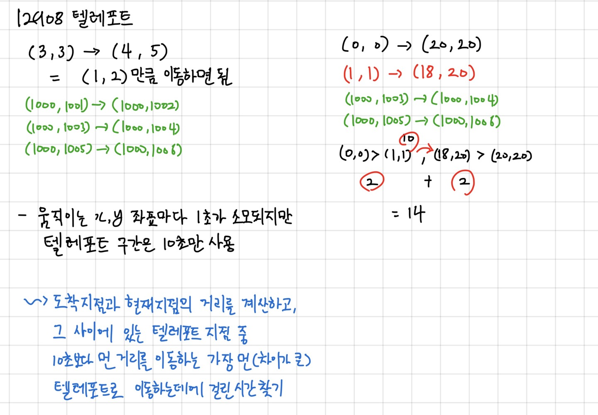

# [12908. 텔레포트 3](https://www.acmicpc.net/problem/12908)

문제

수빈이는 크기가 무한대인 격자판 위에 살고 있다. 격자판의 각 점은 두 정수의 쌍 (x, y)로 나타낼 수 있다.

제일 처음에 수빈이의 위치는 (xs, ys)이고, 집이 위치한 (xe, ye)로 이동하려고 한다.

수빈이는 두 가지 방법으로 이동할 수 있다. 첫 번째 방법은 점프를 하는 것이다. 예를 들어 (x, y)에 있는 경우에 (x+1, y), (x-1, y), (x, y+1), (x, y-1)로 이동할 수 있다. 점프는 1초가 걸린다.

두 번째 방법은 텔레포트를 사용하는 것이다. 텔레포트를 할 수 있는 방법은 총 세 가지가 있으며, 미리 정해져 있다. 텔레포트는 네 좌표 (x1, y1), (x2, y2)로 나타낼 수 있으며, (x1, y1)에서 (x2, y2)로 또는 (x2, y2)에서 (x1, y1)로 이동할 수 있다는 것이다. 텔레포트는 10초가 걸린다.

수빈이의 위치와 집의 위치가 주어졌을 때, 집에 가는 가장 빠른 시간을 구하는 프로그램을 작성하시오.

입력

    첫째 줄에 xs와 ys가, 둘째 줄에 xe, ye가 주어진다. (0 ≤ xs, ys, xe, ye ≤ 1,000,000,000)

    셋째 줄부터 세 개의 줄에는 텔레포트의 정보 x1, y1, x2, y2가 주어진다. (0 ≤ x1, y1, x2, y2 ≤ 1,000,000,000)

    입력으로 주어지는 모든 좌표 8개는 서로 다르다.

출력

    수빈이가 집에 가는 가장 빠른 시간을 출력한다.

----

예제 입력 1 

    3 3
    4 5
    1000 1001 1000 1002
    1000 1003 1000 1004
    1000 1005 1000 1006

예제 출력 1 

    3

----

예제 입력 2 

    0 0
    20 20
    1 1 18 20
    1000 1003 1000 1004
    1000 1005 1000 1006

예제 출력 2 

    14

----

예제 입력 3 

    0 0
    20 20
    1000 1003 1000 1004
    18 20 1 1
    1000 1005 1000 1006

예제 출력 3 

    14

----

예제 입력 4 

    10 10
    10000 20000
    1000 1003 1000 1004
    3 3 10004 20002
    1000 1005 1000 1006

예제 출력 4 

    30

----

예제 입력 5 

    3 7
    10000 30000
    3 10 5200 4900
    12212 8699 9999 30011
    12200 8701 5203 4845

예제 출력 5 

    117



풀이

```python
start = list(map(int, input().split()))
end = list(map(int, input().split()))

teleport = [] # [list(map(int, input().split())) for _ in range(3)]
for i in range(3):
    temp = list(map(int, input().split()))
    if sum(temp[2:]) - sum(temp[:2]) > 10: # 텔레포트 하는 거리가 10보다 큰지 아닌지 확인 (유효성 검?사)
        if temp[0] > start[0] and temp[1] > start[1]: # 텔레포트 시작이 실제 시작보다 멀리 있는지
            if temp[2] < end[0] and temp[3] < end[1]: # 텔레포트 끝이 실제 끝보다 앞에 있는지 
                teleport.append(temp)

time = 0

### 아... 구현문제가 아니었네 
```