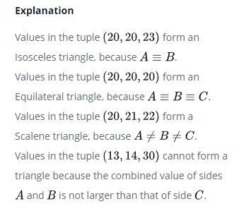

# Type of Triangle

Write a query identifying the type of each record in the TRIANGLES table using its three side lengths. Output one of the following statements for each record in the table:

- Equilateral: It's a triangle with  sides of equal length.
- Isosceles: It's a triangle with  sides of equal length.
- Scalene: It's a triangle with  sides of differing lengths.
- Not A Triangle: The given values of A, B, and C don't form a triangle.

### Input Format

The TRIANGLES table is described as follows:


Each row in the table denotes the lengths of each of a triangle's three sides.

### Sample Input


### Sample Output

```
Isosceles
Equilateral
Scalene
Not A Triangle
Explanation
```




```SQL
SELECT
    CASE
        WHEN (A + B > C) AND (A + C > B) AND (B + C > A) THEN
        CASE
            WHEN (A = B) AND (B = C) THEN "Equilateral"
            WHEN (A = B) OR (A = C) OR (B = C) THEN "Isosceles"
            ELSE "Scalene"
            END
        ELSE "Not A Triangle"
    END
FROM
    TRIANGLES;
```